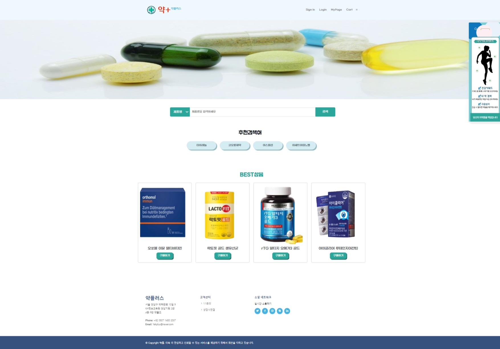
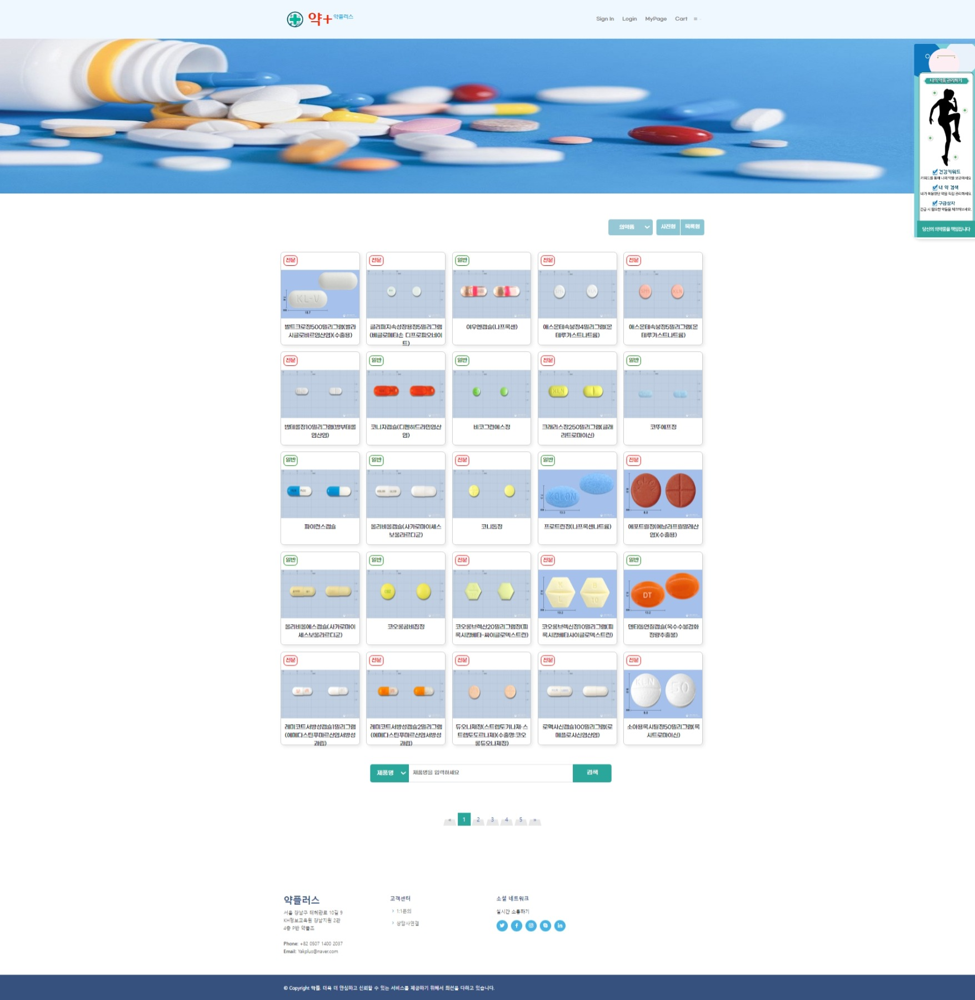
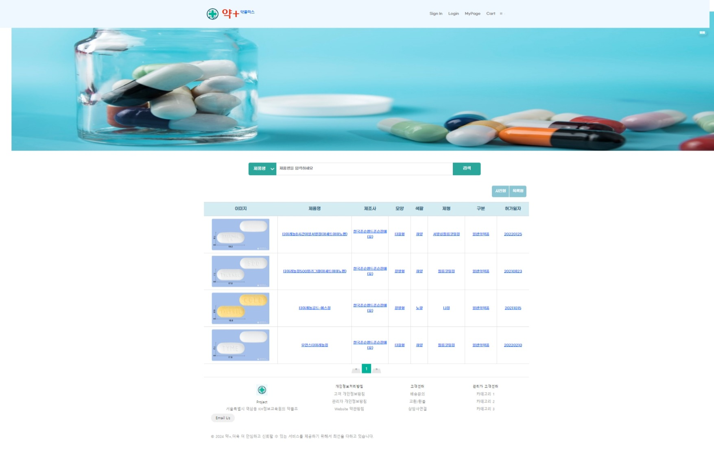
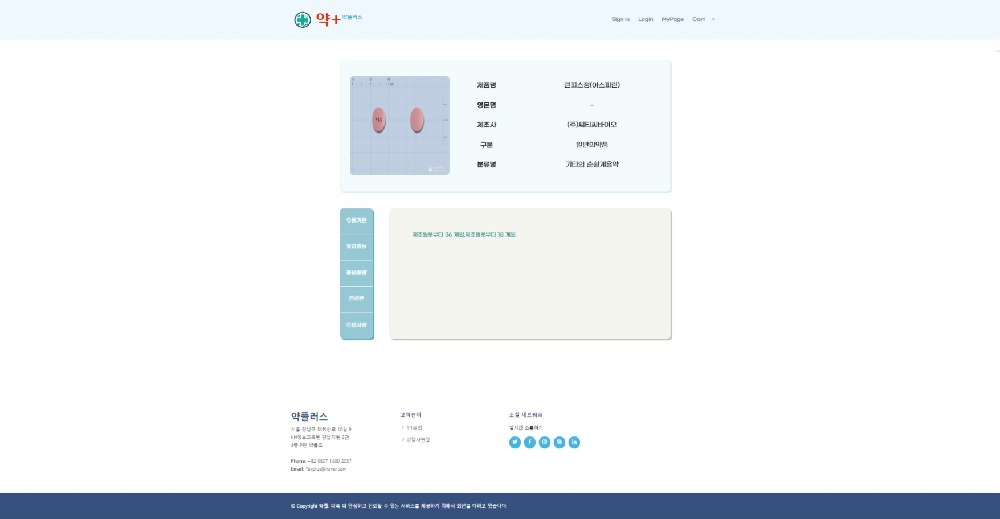
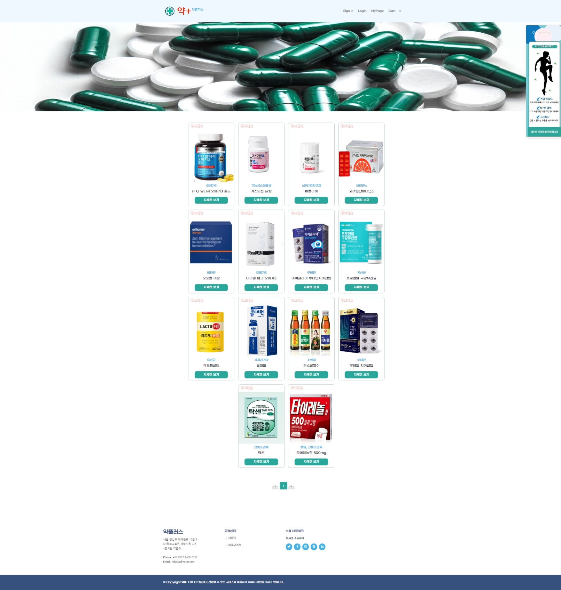
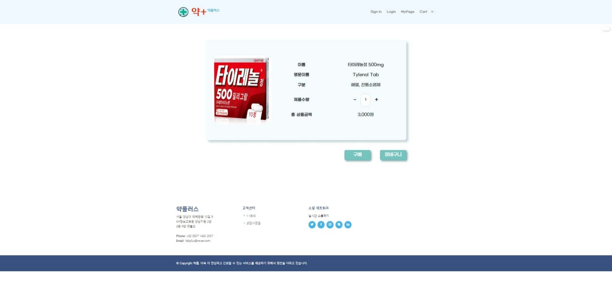

 # 프로젝트명 : 약플러스
 팀원 : 김동현,김명주, 김지원,박보령, 안은선, 이해미
 
### 사용된 기술 스택

## 안은선
담당 파트 : 의약품 검색창, 검색결과페이지(사진형,목록형), 의약품조회 상세페이지, 구매목록, 구매상세페이지

## 검색창

## 의약품조회 사진형페이지

## 의약품조회 목록형페이지

## 의약품조회 상세페이지

## 구매목록창

## 구매 상세페이지

